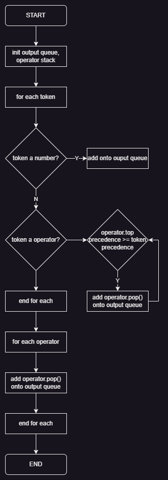

# Shunting Yard Algorithm

Understanding and implementing the shunting yard algorithmn in Python.

## Progress

Currently, the shuntning yard algorithm supports:

- Negative and decimal numbers
- +-*/ operators
- Custom functions
- Brackets
- Commas

The tokenizer supports:

- Whitespace stripping
- One character tokens
- Negative awnd decimal numbers
- Strings
- Custom functions
- And has an error handler for unrecognised characters

## Flowchart Diagram

